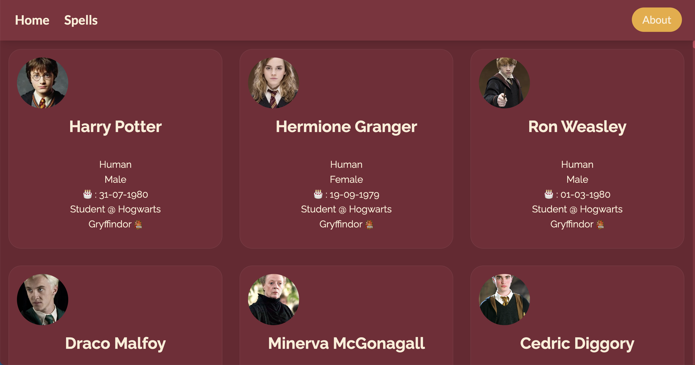

# All About Harry Potter

## About

This is a side project I did to help me learn how to use the new SvelteKit framework to develop responsive web applications. I am still learning and am going to expand on this project more, and possibly eventually deploy it.




### Tools

- [SvelteKit](https://kit.svelte.dev/): A UI framework built on Svelte and Vite, allowing users to write neat components using their folder structure, along with simple HTML, CSS, and JavaScript.

- [Harry Potter API](https://github.com/KostaSav/hp-api): The API that produces all characters, their attributes, and all the spells (to be added). The website for the API can be found [here](https://hp-api.onrender.com/).

- [Skeleton](https://www.skeleton.dev/): Controls most of the styles from this page. It is a package currently in beta that combines [TailwindCSS](https://tailwindcss.com) and [Svelte](https://svelte.dev).

### Try It

First, lets clone this repository.

```bash
git clone "https://github.com/mcclainclain/potter-svelte"
```

Then we need to install our packages with [npm](https://nodejs.org/en/download/) (node package manager).

```bash
npm install
```

This will install all the dependencies that this project needs.
You can now edit all the Svelte files, and change them how you want.

To open a server in your browser to observe changes you make:

```bash
npm run dev -- --open
```

### TODOs

- [X] add an about page
- [X] finish out full character pages
- [X] add spells
- [ ] add search/filter functionality
- [ ] implement more data from other Harry Potter APIs
- [ ] add some more styling (drop shadows??)
